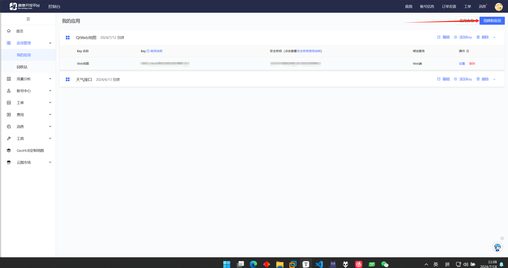
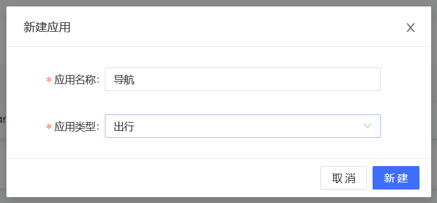
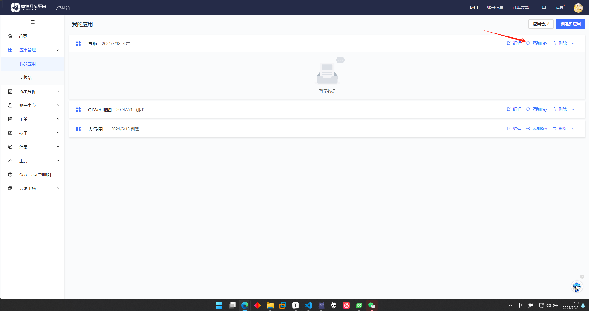
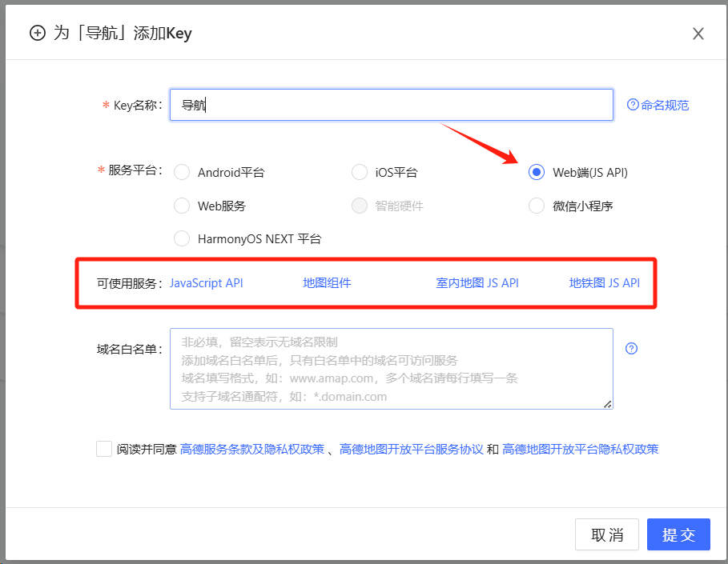
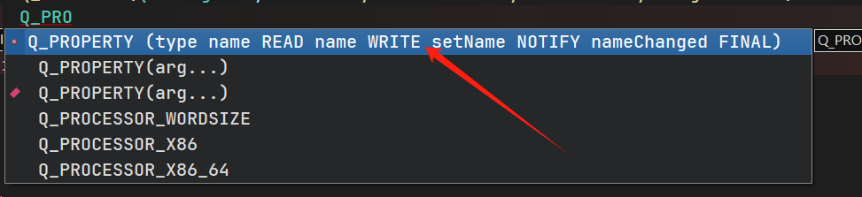
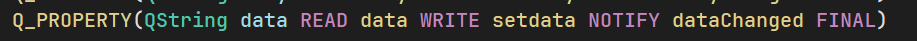
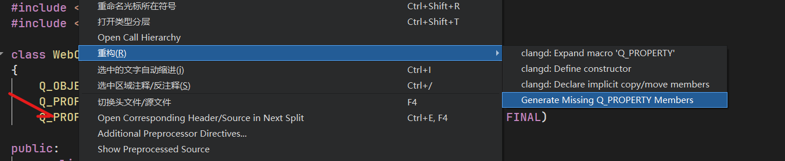
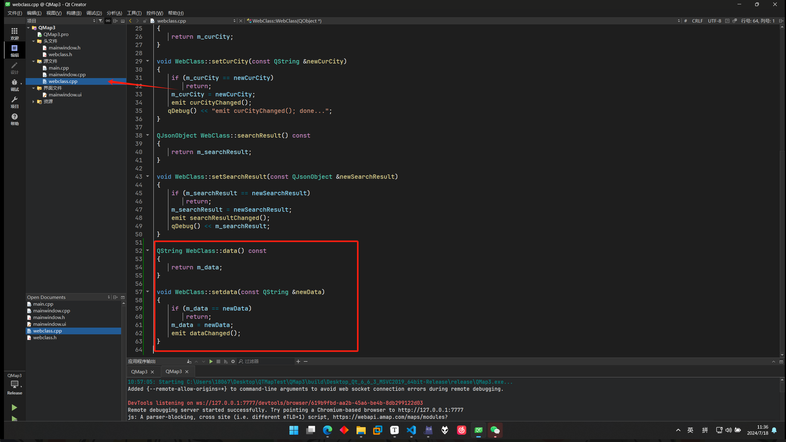
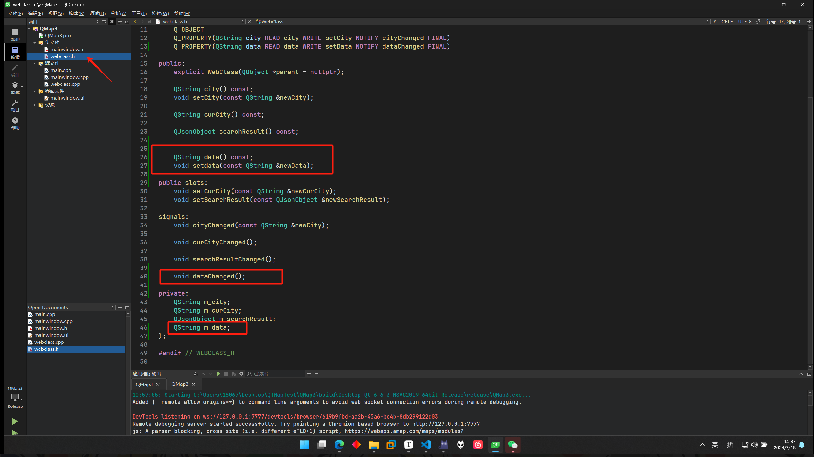
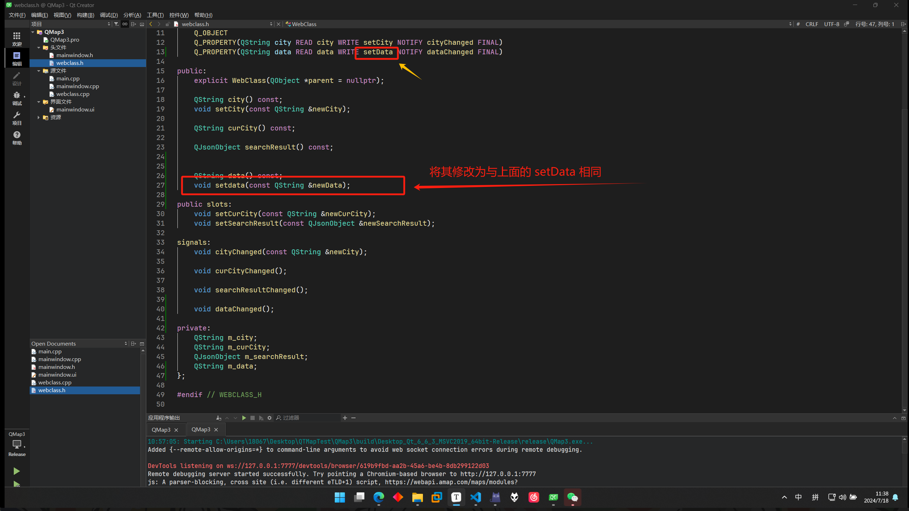

# QWebEngine C++ 高德地图 JS API开发指南

请一定要阅读文档和文档中链接的所有内容

## 配置QWebEngine windows开发环境

详细内容请阅读文档《QWebengine开发环境配置 Windows》。

---

## 获取高德地图 JS API

1. 创建应用


按需求填写



2. 添加Key





==注意：在2021年12月02日以后申请的 key 需要配合你的安全密钥一起使用。==

[JS API 安全密钥使用-基础-进阶教程-地图 JS API 2.0 | 高德地图API (amap.com)](https://lbs.amap.com/api/javascript-api-v2/guide/abc/jscode)

---

## QWebEngineView实现浏览器基本功能

参考连接：[Qt嵌入浏览器（一）——QWebEngineView实现浏览器基本功能 - 简书 (jianshu.com)](https://www.jianshu.com/p/352da0c95f3c)

学习掌握，使用QWebEngineView访问网页。

以及通过http://localhost:7777调试网页。

> 编者推荐直接使用浏览器打开html文件，通过F12，打开控制台来调试

---

## HTML以及交互类的编写参考

高德 JS API 的三个参考文档，提供了API的所有注意事项和例子 

1. [教程](https://lbs.amap.com/api/javascript-api/guide/services/autocomplete)
2. [示例中心](https://lbs.amap.com/api/javascript-api/example/input/get-input-data)
3. [参考手册](https://lbs.amap.com/api/javascript-api/reference/search#m_AMap.Autocomplete)

---

## JS 与 QT C++ 的交互

参考连接：[最清晰Qt与JS通过qwebchannel交互例子_qwebchannel.js-CSDN博客](https://blog.csdn.net/sunnyloves/article/details/88683090)

参考连接：[Communication between C++ and Javascript in Qt WebEngine – My Programming Notes](https://myprogrammingnotes.com/communication-c-javascript-qt-webengine.html)

需要掌握：

- JS 调用 C++ 函数
- JS 向 C++ 传递数据

- C++ 调用 JS 函数
- C++ 向 JS 传递数据

**有关C++向js传递数据的补充：**

**比文档中更好的办法如下：**

1. QT中选择下图中的`Q_PROPERTY`补全



2. 修改好`type`和`name`



3. 右键写好的`Q_PROPERTY`。选择 重构 --> `Generate Missing Q_PROPERTY Members`



4.QT自动生成了如下函数





5. 注意下图中的函数名，并进行修改后



==.cpp 文件中的函数名也需要修改==

6. html中的调用

示例：

```javascript
foo.data = "Hello";
```

C++ 中 `m_data`的值被修改为`"Hello"`

---

## 需要注意的点

`HTML`中若有对象未定义/实现，网也并不会失效，而是在使用了该对象的地方停止

示例：

```javascript
 // 初始化 autoComplete 对象
var autoComplete;
AMap.plugin(['AMap.Autocomplete'], function () {
    autoComplete = new AMap.Autocomplete({});
});

function getCurCity()//用来获取当前地图中心点所在城市
{
    console.log("Test");
    map.getCity(function (place) {
        if (place.city == "") {
            console.log("City is empty, setting province:", place.province);
            autoComplete.setCity(place.province);
            curcity = place.province;
        }
        else {
            console.log("City found, setting city:", place.city);
            autoComplete.setCity(place.city);
            curcity = place.city;
            console.log(curcity);
        }
        console.log(curcity);
        foo.setCurCity(curcity);
    });
}
```

假设上面代码中的 1 - 6 行没有编写。即对象`autoComplete`没有实现。代码不会报错，且可以正常运行。

但是，会出现如下现象:

控制台输出了 第9行和第11行（假设`if`符合条件）的结果。但是22行和23行没有输出。

这是因为对象`autoComplete`没有定义/实现。程序在使用该对象的地方结束了。