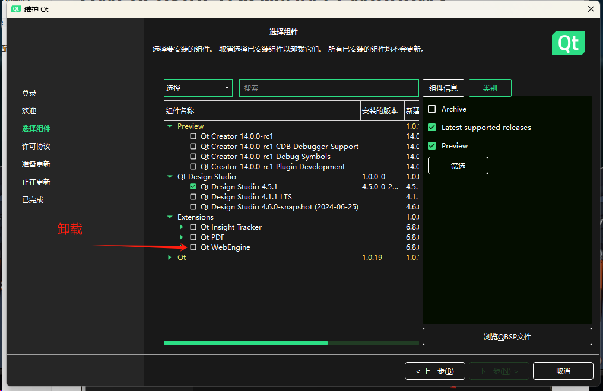
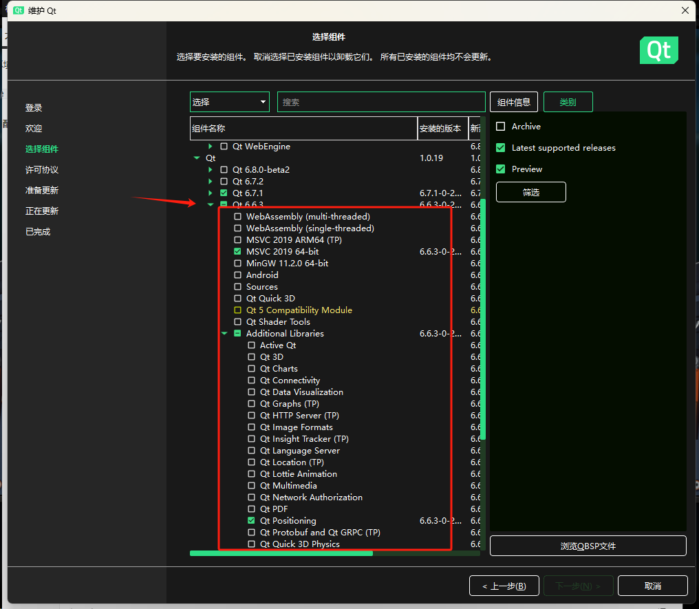
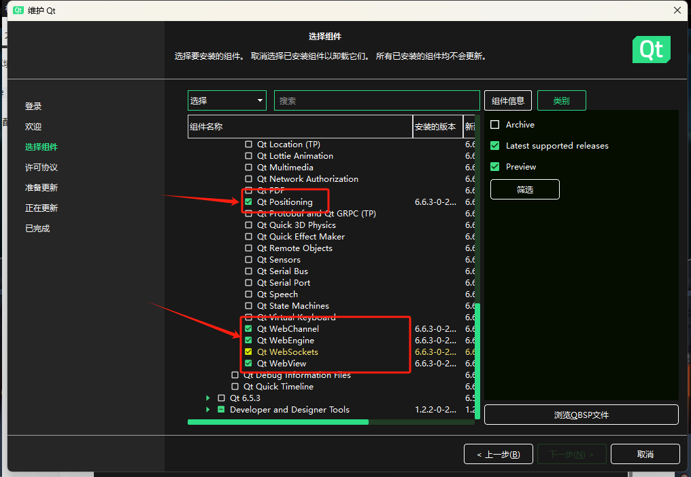
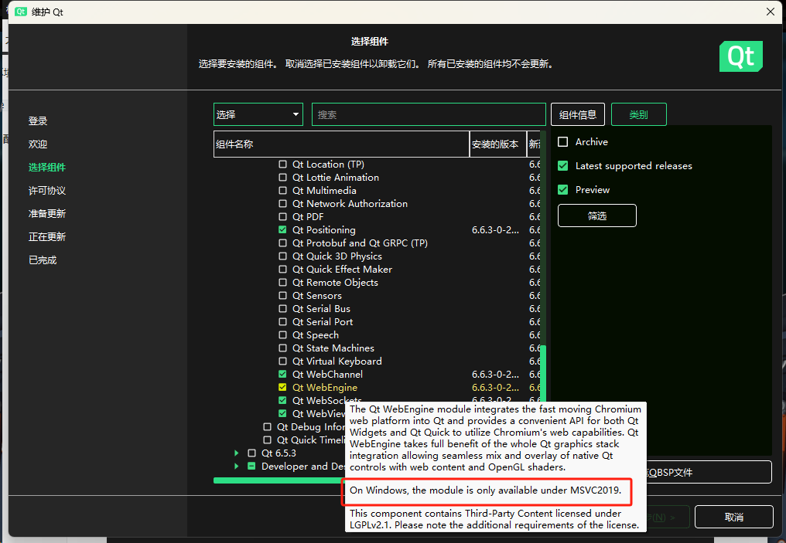
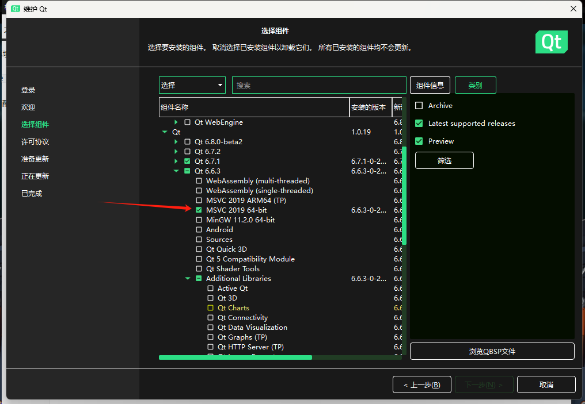
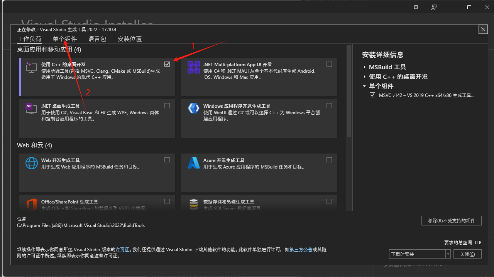

# QWebengine开发环境配置 Windows

## `QT Maintenance Tool`下载组件

打开`QT Maintenance Tool`

不要安装这个

选择一个组件齐全的版本 

选择一下组件 

注意webengine的说明

按照说明，选择同一版本内对应的 MSVC

---

## `visual studio`配置

[下载 Visual Studio Tools - 免费安装 Windows、Mac、Linux (microsoft.com)](https://visualstudio.microsoft.com/zh-hans/downloads/)

选择对应版本

注意：选择的是`生成工具`

---

## QT配置

查看配置是否自动识别出来了，如下图所示。

一般是有了，如果没有如下配置

然后再回去构建套件那里选一下